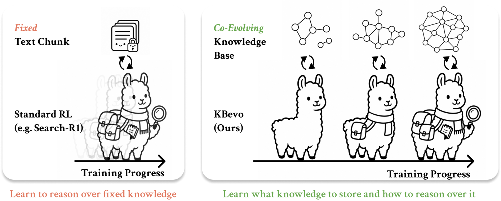
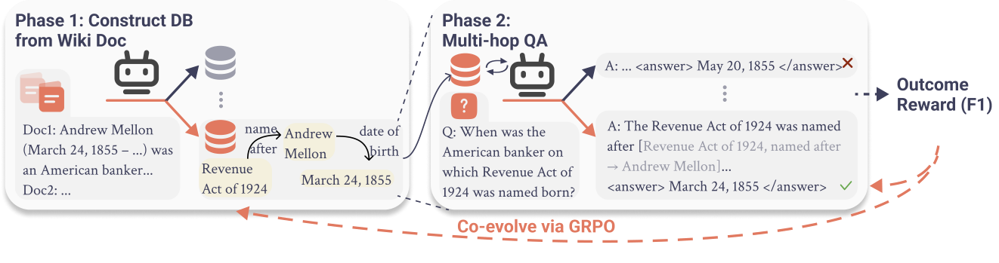

# Co-Evolving Structured Knowledge and Reasoning in Language Models

<p align="center">
  
</p>

<p align="center">
  <strong>Official repository for:</strong><br>
  <strong>Co-Evolving Structured Knowledge and Reasoning in Language Models</strong> (COLM 2026)
</p>

<p align="center">
  <a href="https://arxiv.org/abs/2608.26386">📄 arXiv</a> •
  <a href="https://menghan-xu.github.io/KBevo/">🌐 Website</a> •
  <a href="https://huggingface.co/collections/kilian-group/kbevo-6aa87f4fd519a8e5d76554ac">🤗 Models &amp; Data</a> •
  <a href="https://github.com/kilian-group/KBevo">💻 GitHub</a>
</p>

---

## What is KBevo?

Retrieval-augmented methods improve factual accuracy by grounding language models in external
knowledge, but retrieving over unstructured text often introduces irrelevant context and offers
limited control over the retrieved information. Structured knowledge bases offer a more
controllable alternative, yet they are expensive to construct and often brittle to reason over.

**KBevo** addresses these limitations with a co-evolving framework that jointly learns to
construct a structured knowledge base and reason over it for knowledge-intensive question
answering. By optimizing both components end-to-end with QA outcome rewards, reasoning
success directly improves the quality of the constructed knowledge base. This leads to
larger, better-connected knowledge structures with higher answer reachability, while also
improving compositional factual reasoning and controllability compared to standard retrieval
baselines.

<p align="center">
  
</p>

At inference the same model runs a **two-phase policy**:

1. **Phase 1: KB construction.** The model reads a collection of input documents and emits
   a structured KB of `(entity, relation, value)` triples using four special tokens
   `<|db_entity|>`, `<|db_relationship|>`, `<|db_return|>`, `<|db_end|>`. The resulting KB
   is fixed and reused across downstream questions: the paper's evaluation aggregates
   extracted triples into **one retrieval datastore per benchmark**.
2. **Phase 2: QA.** For each question the model issues structured lookups against the
   fixed KB (again via the `<|db_*|>` tokens); vLLM stops on `<|db_return|>` so a
   nearest-neighbor retriever can splice the KB value back into the running trace.

The [`examples/single_example.py`](examples/single_example.py) demo builds a KB from a small
per-example passage set for convenience; that is not the paper eval protocol.

Training is a two-stage pipeline: **SFT** on 6k Gemini-generated two-phase trajectories,
then **GRPO** with a factored rollout structure (`K=4` phase-1 KBs × `N=32` phase-2 QAs per
question, `M = N/K = 8` QAs per KB) and an F1 outcome reward.

---

## Table of Contents

- [Released artifacts](#released-artifacts)
- [Installation](#installation)
- [Quick Start](#quick-start)
- [Repository structure](#repository-structure)
- [SFT training](#sft-training)
- [GRPO training](#grpo-training)
- [Evaluation](#evaluation)
- [Configuration](#configuration)
- [GRPO variants (ablations)](#grpo-variants-ablations)
- [Citation](#citation)

---

## Released artifacts

Everything below lives in the
[KBevo collection](https://huggingface.co/collections/kilian-group/kbevo-6aa87f4fd519a8e5d76554ac)
on the Hugging Face Hub. All released model weights are **BF16**. See
[`configs/artifacts.yaml`](configs/artifacts.yaml) for the authoritative manifest.

| Model | Stage | Base | Init | 🤗 |
|---|---|---|---|---|
| `KBevo-Qwen3-1.7B-SFT` | SFT | Qwen/Qwen3-1.7B | n/a | [🤗](https://huggingface.co/kilian-group/KBevo-Qwen3-1.7B-SFT) |
| `KBevo-Qwen3-1.7B-GRPO` | GRPO | Qwen/Qwen3-1.7B | 1.7B-SFT (step 368) | [🤗](https://huggingface.co/kilian-group/KBevo-Qwen3-1.7B-GRPO) |
| `KBevo-Qwen3-4B-SFT` | SFT | Qwen/Qwen3-4B | n/a | [🤗](https://huggingface.co/kilian-group/KBevo-Qwen3-4B-SFT) |
| `KBevo-Qwen3-4B-GRPO` | GRPO | Qwen/Qwen3-4B | 4B-SFT (step 735) | [🤗](https://huggingface.co/kilian-group/KBevo-Qwen3-4B-GRPO) |

**SFT dataset.** Released as
[`kilian-group/KBevo-SFT-hotpotqa-6k`](https://huggingface.co/datasets/kilian-group/KBevo-SFT-hotpotqa-6k)
(~11.7k full two-phase trajectories over ~5.7k unique HotpotQA train questions,
license Apache-2.0 per the dataset card).

---

## Installation

```bash
# 1. Clone the repo.
git clone https://github.com/kilian-group/KBevo.git
cd KBevo

# 2. Create the conda env (Python 3.11 + torch 2.8 + vLLM 0.10.2, etc.).
conda env create -f environment.yml
conda activate kbevo

# 3. (Optional) editable install of this repo so the modules under `src/`
#    (`agent/`, `data/`, `eval/`, `multi_lmlm/`, ...) are importable without
#    manually setting `PYTHONPATH=src`.
pip install -e .

# 4. Copy the site-config template and edit the values in place.
cp configs/cluster.env.example configs/cluster.env
$EDITOR configs/cluster.env
```

`configs/cluster.env` is git-ignored and stores site-specific paths, optional W&B settings,
and optional SLURM resources. Copy the provided template and edit it for your environment;
leaving the W&B variables unset disables W&B logging.

On a SLURM cluster, submit jobs through `scripts/submit_slurm.sh`, which reads the `SLURM_*`
settings from `configs/cluster.env`. Without SLURM, run the canonical scripts directly with
`bash`.

**No hard requirement on FlashAttention.** The environment installs `xformers==0.0.32.post1`
which matches `torch==2.8.0`; both are Blackwell-ready. Install `flash-attn` separately only
if you want faster attention on Ampere/Hopper.

### Hardware notes

The paper's training runs used 4× B200 for GRPO and 1× B200 for SFT. `scripts/train_grpo.sh`
ships `--gpu_type {B200, H100}` presets that adjust hardware knobs only
(`per_device_batch_size`, `vllm_gpu_memory_utilization`, accelerate config). Scientific
hyperparameters (`learning_rate=5e-6`, `num_generations=32`, etc.) come from the paper
YAML and are constant across GPU types. On other GPUs pass explicit
`--per_device_batch_size` / `--vllm_gpu_memory_utilization` overrides.

---

## Quick Start

Scripts run directly; Slurm is optional.

**Fastest smoke**: 5 examples per dataset on all four benchmarks (~2 min after model
download), using a released checkpoint:

```bash
bash scripts/eval_kbevo.sh \
    --model_path kilian-group/KBevo-Qwen3-1.7B-GRPO \
    --datasets hotpotqa,musique,2wiki,popqa \
    --num_samples 5
```

**Subset evaluation**: 1,000 examples per dataset (much slower; useful for a
representative signal without the full validation split):

```bash
bash scripts/eval_kbevo.sh \
    --model_path kilian-group/KBevo-Qwen3-1.7B-GRPO \
    --datasets hotpotqa,musique,2wiki,popqa \
    --num_samples 1000
```

**Paper's full evaluation**: one command per dataset at its full validation-split size:

| Dataset         | Paper eval size |
|-----------------|----------------:|
| HotpotQA        |           7,405 |
| MuSiQue         |           2,417 |
| 2WikiMultiHopQA |          12,576 |
| PopQA           |           1,399 |

`--model_path` accepts either a **local checkpoint directory** or a **Hugging Face repo id**
of the form `owner/name` (it materializes the latter to a local snapshot).

**Single-example inference demo** (no dataset loader required). Defaults to
`kilian-group/KBevo-Qwen3-1.7B-GRPO` and prints the Phase-1 KB triples and Phase-2 lookup
trace alongside the final answer:

```bash
python examples/single_example.py \
    --model-path kilian-group/KBevo-Qwen3-1.7B-GRPO \
    --output-path examples/single_example_output.json
```

### Optional: Running with Slurm

You can either configure resources in `configs/cluster.env` and use the provided wrapper:

```bash
bash scripts/submit_slurm.sh grpo-1.7b
```

or edit the `#SBATCH` directives in the script and submit it directly:

```bash
sbatch scripts/grpo_variants/train_two_phase_1.7b.slurm
```

Resource options may also be passed directly to `sbatch`. The same approaches work for SFT and evaluation.

---

## Repository structure

```
KBevo/
├── configs/
│   ├── accelerate/           # accelerate multi_gpu_{1,2,4,8}.yaml
│   ├── artifacts.yaml        # authoritative released-artifact manifest
│   ├── cluster.env.example   # site-specific defaults (conda env, ckpt roots, W&B, ...)
│   └── paper/                # paper configuration files (sft/grpo/eval)
├── data/
│   └── prompts/              # database_creation.json (phase-1 prompt), lmlm_agent.json
├── environment.yml           # conda env definition
├── examples/
│   ├── mini_sft.json         # 3 real SFT examples (schema + smoke)
│   ├── single_example.py     # one-question two-phase demo (CPU-safe --help)
│   └── expected_output.json  # illustrative output schema
├── pyproject.toml            # kbevo package metadata (MIT)
├── scripts/
│   ├── eval_kbevo.sh         # canonical 4-dataset two-phase eval wrapper
│   ├── kbevo_hf_smoke.slurm  # HF-repo-load smoke test
│   ├── train_grpo.sh         # canonical GRPO trainer (all sizes)
│   ├── train_sft.sh          # canonical SFT trainer (all sizes)
│   └── grpo_variants/        # 6 ablation slurm wrappers + README.md
└── src/
    ├── agent/                # TwoPhaseAgent, LMLMAgent (canonical inference)
    ├── data/                 # HotpotQA, MuSiQue, 2WikiMultiHopQA, PopQA loaders
    ├── eval/                 # evaluate.py (F1/EM), metrics.py
    ├── eval_multihop.py      # top-level eval driver
    ├── grpo_train.py         # GRPO trainer entrypoint (called by train_grpo.sh)
    ├── llm/                  # vLLM / HF backends
    ├── multi_lmlm/           # DatabaseManager, TopKRetriever, prompts, constants
    ├── reward_func.py        # F1 / F1-format outcome rewards
    ├── sft_train.py          # SFT trainer entrypoint (called by train_sft.sh)
    ├── tools/                # merge_shard_results, merge_unified_dbs (standalone CLIs)
    └── trainer/              # lmlm_basetrainer (two-phase GRPO advantage)
```

---

## SFT training

The paper trains Qwen3-1.7B and Qwen3-4B on **6k Gemini-generated HotpotQA two-phase
trajectories** for 3 epochs, effective batch 48, lr 5e-5. The SFT dataset is released as
[`kilian-group/KBevo-SFT-hotpotqa-6k`](https://huggingface.co/datasets/kilian-group/KBevo-SFT-hotpotqa-6k)
(status: see `configs/artifacts.yaml`).

```bash
# Download the SFT dataset once into the repo's data/ dir (git-ignored),
# then point --dataset_path at the resulting trajectories.json.
huggingface-cli download kilian-group/KBevo-SFT-hotpotqa-6k \
    --repo-type dataset --local-dir data/sft

bash scripts/train_sft.sh \
    --model_size 1.7B \
    --dataset_path data/sft/trajectories.json
```

or set `KBEVO_SFT_DATA=<path>` once in `configs/cluster.env` and omit `--dataset_path`.

Add `--debug` to run a smoke: 1 optimizer step over the bundled
`examples/mini_sft.json`, isolated per-invocation output directory:

```bash
bash scripts/train_sft.sh --model_size 1.7B --debug
```

Full hyperparameters used in the paper are recorded in
[`configs/paper/sft_qwen3_1.7b.yaml`](configs/paper/sft_qwen3_1.7b.yaml) and
[`configs/paper/sft_qwen3_4b.yaml`](configs/paper/sft_qwen3_4b.yaml).

---

## GRPO training

The paper runs two-phase GRPO from an SFT init (step 368 for 1.7B, step 735 for 4B), for 500
steps, effective batch 512, lr 5e-6. Each question fans out into **K=4 Phase-1 KB rollouts**
and **N=32 Phase-2 QA rollouts** (M = N/K = 8 QAs per KB; total 36 generations/question).
Retrieval uses cosine-similarity top-k=4 at threshold 0.6 over the freshly-built KB, with
inverse relations enabled. The reward is token-level F1 on the final answer.

The one-line paper reproduction:

```bash
# Uses kilian-group/KBevo-Qwen3-1.7B-SFT as the init by default. Override with
# KBEVO_SFT_1_7B_CKPT=<local dir> in configs/cluster.env if you have a local ckpt.
bash scripts/grpo_variants/train_two_phase_1.7b.slurm
```

For 4B:

```bash
bash scripts/grpo_variants/train_two_phase_4b.slurm
```

Both launchers accept additional GRPO arguments. Add `--debug` to run a one-step smoke test with reduced data and a separate output directory:

```bash
bash scripts/grpo_variants/train_two_phase_1.7b.slurm --debug
```

Full hyperparameters are in [`configs/paper/grpo_qwen3_1.7b.yaml`](configs/paper/grpo_qwen3_1.7b.yaml)
and [`configs/paper/grpo_qwen3_4b.yaml`](configs/paper/grpo_qwen3_4b.yaml). Note that `total_batch_size=512` is the
**optimizer** effective batch and is independent of the rollout structure (36 generations
per question).

---

## Evaluation

The canonical evaluator runs the two-phase agent on HotpotQA (distractor), MuSiQue, 2Wiki,
and PopQA and reports EM / F1 per dataset.

```bash
bash scripts/eval_kbevo.sh --model_path <local_or_hf_repo> \
                           [--datasets hotpotqa,musique,2wiki,popqa] \
                           [--num_samples 1000] \
                           [--save_version _mytag] \
                           [--output-dir ./output/main_tables]
```

Full parameters (seed, top-k, threshold, sampling, max tokens) are recorded in
[`configs/paper/eval_kbevo.yaml`](configs/paper/eval_kbevo.yaml).

`--model_path` may be a local checkpoint directory or a Hugging Face repo id (owner/name).
Per-dataset preds JSONs and aggregate metrics land under `--output-dir` (default
`./output/main_tables/two_phase/<dataset>/<model_tag>/`).

To score an existing preds JSON on its own, use
[`src/eval/evaluate.py:evaluate_file`](src/eval/evaluate.py) programmatically.

---

## Configuration

Paper configurations are provided under [`configs/paper/`](configs/paper/).

| File                                                         | Configuration        |
| ------------------------------------------------------------ | -------------------- |
| [`sft_qwen3_1.7b.yaml`](configs/paper/sft_qwen3_1.7b.yaml)   | Qwen3-1.7B SFT       |
| [`sft_qwen3_4b.yaml`](configs/paper/sft_qwen3_4b.yaml)       | Qwen3-4B SFT         |
| [`grpo_qwen3_1.7b.yaml`](configs/paper/grpo_qwen3_1.7b.yaml) | Qwen3-1.7B GRPO      |
| [`grpo_qwen3_4b.yaml`](configs/paper/grpo_qwen3_4b.yaml)     | Qwen3-4B GRPO        |
| [`eval_kbevo.yaml`](configs/paper/eval_kbevo.yaml)           | Two-phase evaluation |

The SFT and GRPO launchers load the corresponding YAML configuration by default. Pass a CLI argument to override a value for an individual run.

---

## GRPO variants (ablations)

The launchers under [`scripts/grpo_variants/`](scripts/grpo_variants/) reproduce the paper's main GRPO runs and ablations. They delegate to the canonical [`scripts/train_grpo.sh`](scripts/train_grpo.sh) implementation.

| Variant | Purpose | Model |
|---|---|---|
| `train_two_phase_1.7b.slurm` | Paper main two-phase GRPO on Qwen3-1.7B | 1.7B |
| `train_two_phase_4b.slurm`   | Paper main two-phase GRPO on Qwen3-4B   | 4B   |
| `train_one_phase.slurm`      | Ablation: 1-phase SFT + static Gemini DB | 1.7B |
| `train_vanilla_grpo.slurm`   | Ablation: vanilla GRPO advantage, N=16   | 1.7B |
| `train_zero_rl.slurm`        | Ablation: GRPO from raw Qwen3-1.7B (no SFT) | 1.7B |
| `train_curriculum.slurm`     | Ablation: tier-filtered curriculum over 90k | 1.7B |

---

## Citation

```bibtex
@inproceedings{Noonan2026:co-evolving,
  title         = {Co-Evolving Structured Knowledge and Reasoning in Language Models},
  author        = {Ryan Thomas Noonan and Linxi Zhao and Menghan Xu and Akanksha Sarkar and Mihir Mishra and Dongyoung Go and Kilian Q. Weinberger and Yoav Artzi and Jennifer J. Sun},
  booktitle     = {Proceedings of the Conference on Language Modeling},
  year          = {2026},
  url           = {https://arxiv.org/abs/2608.26386}
}
```

